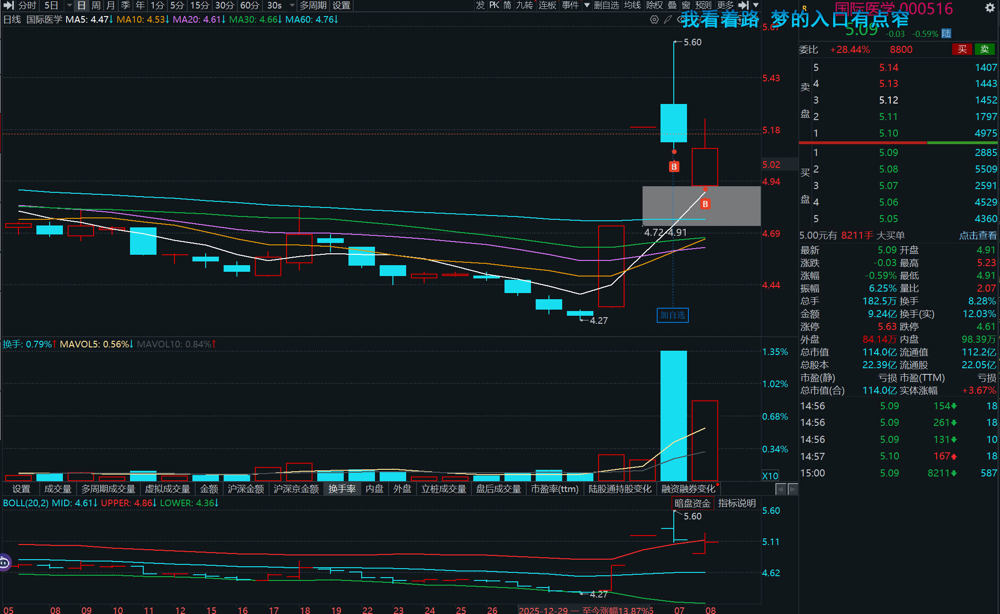
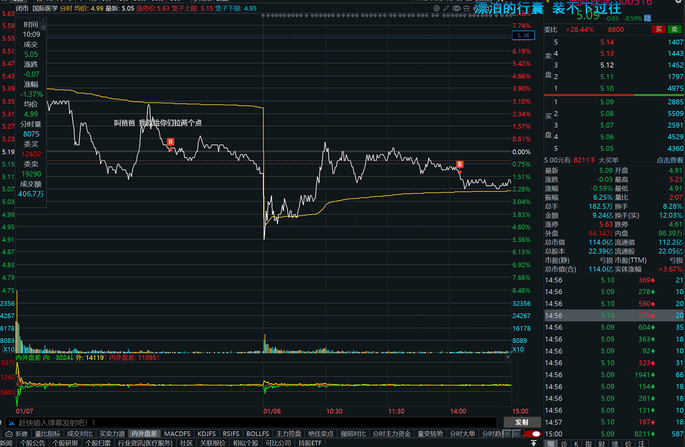

**题记:**

**这不是我的黑历史,**

**这是我来时的路......**

# 2026.01.08

今天与000516相会 , 5.19进入你的时候你不红,5.12进入你的时候,你却绿了...

**K线图:**

**分时图:**

## 个人情况分析:

当时以为它能涨,看了好几个小时的分时图 ,从4.91慢慢涨到5.6然后又开始回调 , 感觉还会涨,就挂了单了,看着它跌跌涨涨,我是挂了又撤,一直在5.13 5.14之间跳动  突然它掉到了5.12、5.11、5.10、5.09 然后就没起来一样 就像是5.6已经让他弹尽粮绝一样疲软了。

**人性三件事从未改变：**

- 贪婪
- 恐惧
- 犹豫

哈哈 就像是初入江湖的一样 ,充满着幻想 , 突然我就想通了一点,我是个人,我会贪婪,我会恐惧,我会犹豫,不过这种感觉还不错 是真的刺激呀 老是这么佛系都快感觉自己不像是个人了.

做一个小规划吧,看上一点书,了解熟悉一下指标工具的用法 ,下次就不会像是"空手去参加二战"了.

现在的我看这个红红绿绿的线 还是有点头皮发麻的 知识体系有点 不完善 我得先学会知识 学会抄作业 学会自己做作业 直面本我 打磨本我

这次处女挂体验感还行,至少今天没有那么的难受.

## 股票分析:

这个后面等 知识体系稍微完善了 再回来好好分析一下 现在还不会复盘 如果有人看到了 请先不要笑话我 我正在成长😄
